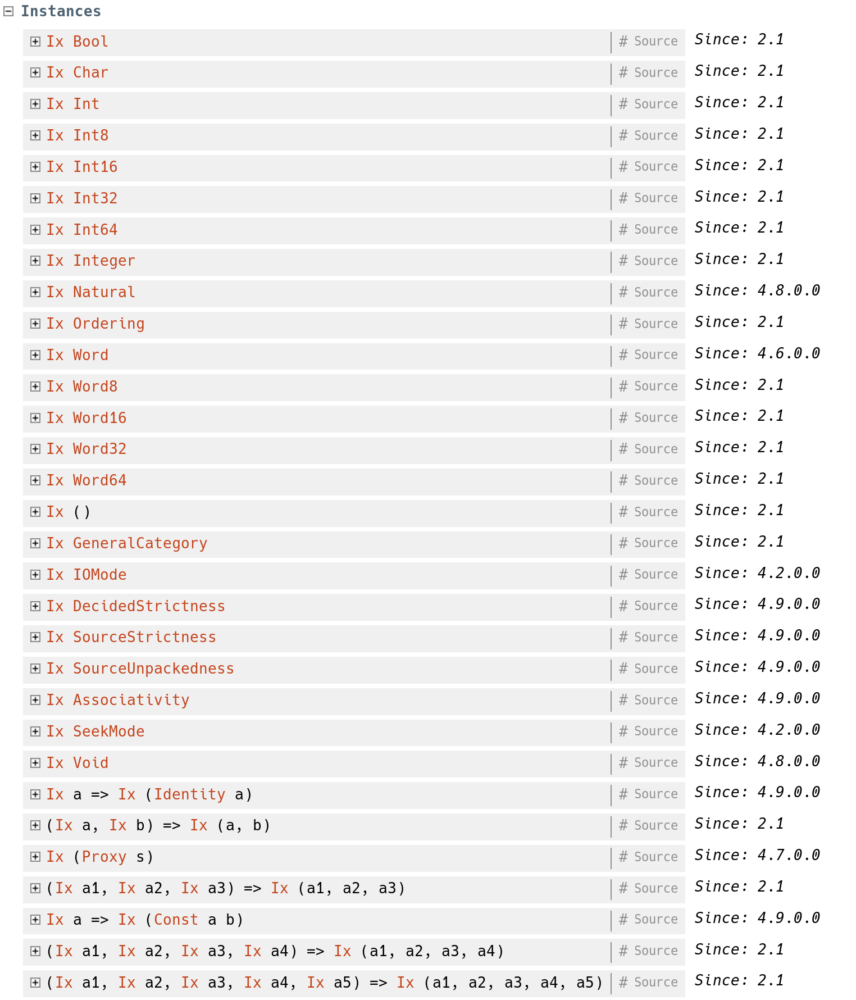

# 数组与散列
## 数组
### Data.Ix

这个类定义了那些类型能够作为数组的下标
```haskell
class (Ord a) => (Ix a) where
    range :: (a, a) -> [a] -- 生成连续列表
    index :: (a, a) -> [a] -> Int -- 在范围中定位，越界报错
    -- unsafeIndex 不检查越界
    inRange :: (a, a) -> a -> Bool -- 检查是否在范围内
    rangeSize :: (a, a) -> Int -- 返回范围长度
    -- unsafeRangeSize 不检查合法性
```

相关实例和规则如下：


对于用户自己定义的枚举量，如
```haskell
data Colour = Red | Orange | Yellow | Green | Blue | Indigo | Violet
```
也可以被推导为`Ix`类，偏序关系同`Enum`

### 构造和方法

见[Hackage](http://hackage.haskell.org/package/array-0.5.3.0/docs/Data-Array.html)

### 性能和操作

`Data.Array`中的数组元素是打包的，所以需要跳转；`Data.Array.Uboxed`中`UArray`是严格求值版本的`Array`，只提供了基础类型的支持。

`Data.Array.IArray`则是一个类型类，为两者提供了统一接口

```haskell


(!) :: (IArray a e, Ix i) => a i e -> i -> e

-- Returns the element of an immutable array at the specified index.

bounds :: (IArray a e, Ix i) => a i e -> (i, i)

-- Extracts the bounds of an immutable array

indices :: (IArray a e, Ix i) => a i e -> [i]

-- Returns a list of all the valid indices in an array.

elems :: (IArray a e, Ix i) => a i e -> [e]

-- Returns a list of all the elements of an array, in the same order as their indices.

assocs :: (IArray a e, Ix i) => a i e -> [(i, e)]

-- Returns the contents of an array as a list of associations.

(//) :: (IArray a e, Ix i) => a i e -> [(i, e)] -> a i e 

-- Takes an array and a list of pairs and returns an array identical to the left argument except that it has been updated by the associations in the right argument. For example, if m is a 1-origin, n by n matrix, then m//[((i,i), 0) | i <- [1..n]] is the same matrix, except with the diagonal zeroed.

accum :: (IArray a e, Ix i) => (e -> e' -> e) -> a i e -> [(i, e')] -> a i e 

-- accum f takes an array and an association list and accumulates pairs from the list into the array with the accumulating function f. Thus accumArray can be defined using accum.

amap :: (IArray a e', IArray a e, Ix i) => (e' -> e) -> a i e' -> a i e 

-- Returns a new array derived from the original array by applying a function to each of the elements.

ixmap :: (IArray a e, Ix i, Ix j) => (i, i) -> (i -> j) -> a j e -> a i e 

-- Returns a new array derived from the original array by applying a function to each of the indices.
```

### 可变数组

`Array`和`UArray`都是不可变数组，更新的时间复杂度是线性的。

`Data.Array.MArray`这个类型类描述的则是可变数组

```haskell
-- # Constructing mutable arrays

newArray :: (MArray a e m, Ix i) => (i, i) -> e -> m (a i e)

-- Builds a new array, with every element initialised to the supplied value.

newArray_ :: (MArray a e m, Ix i) => (i, i) -> m (a i e)

-- Builds a new array, with every element initialised to an undefined value. In a monadic context in which operations must be deterministic (e.g. the ST monad), the array elements are initialised to a fixed but undefined value, such as zero.

newListArray :: (MArray a e m, Ix i) => (i, i) -> [e] -> m (a i e)

-- Constructs a mutable array from a list of initial elements. The list gives the elements of the array in ascending order beginning with the lowest index.
-- Reading and writing mutable arrays

readArray :: (MArray a e m, Ix i) => a i e -> i -> m e

-- Read an element from a mutable array

writeArray :: (MArray a e m, Ix i) => a i e -> i -> e -> m ()

-- Write an element in a mutable array


-- # Derived arrays 

mapArray :: (MArray a e' m, MArray a e m, Ix i) => (e' -> e) -> a i e' -> m (a i e)

--Constructs a new array derived from the original array by applying a function to each of the elements.

mapIndices :: (MArray a e m, Ix i, Ix j) => (i, i) -> (i -> j) -> a j e -> m (a i e)

-- Constructs a new array derived from the original array by applying a function to each of the indices.


-- # Deconstructing mutable arrays

getBounds :: (MArray a e m, Ix i) => a i e -> m (i, i)

-- Returns the bounds of the array

getElems :: (MArray a e m, Ix i) => a i e -> m [e]

-- Return a list of all the elements of a mutable array

getAssocs :: (MArray a e m, Ix i) => a i e -> m [(i, e)]

-- Return a list of all the associations of a mutable array, in index order.


-- # Conversions between mutable and immutable arrays

freeze :: (Ix i, MArray a e m, IArray b e) => a i e -> m (b i e)

-- Converts a mutable array (any instance of MArray) to an immutable array (any instance of IArray) by taking a complete copy of it.

thaw :: (Ix i, IArray a e, MArray b e m) => a i e -> m (b i e)

-- Converts an immutable array (any instance of IArray) into a mutable array (any instance of MArray) by taking a complete copy of it.


```

具体的实例有`IOArray/IOUArray/STArray/STUArray`
### Unsafe

```haskell
castSTUArray :: STUArray s ix a -> ST s (STUArray s ix b)
```

Casts an STUArray with one element type into one with a different element type. All the elements of the resulting array are undefined (unless you know what you're doing...).

```haskell
castIOUArray :: IOUArray ix a -> IO (IOUArray ix b)
```

Casts an IOUArray with one element type into one with a different element type. All the elements of the resulting array are undefined (unless you know what you're doing...).

```haskell
unsafeFreeze :: (Ix i, MArray a e m, IArray b e) => a i e -> m (b i e)
```

Converts an mutable array into an immutable array. The implementation may either simply cast the array from one type to the other without copying the array, or it may take a full copy of the array.

Note that because the array is possibly not copied, any subsequent modifications made to the mutable version of the array may be shared with the immutable version. It is safe to use, therefore, if the mutable version is never modified after the freeze operation.

The non-copying implementation is supported between certain pairs of array types only; one constraint is that the array types must have identical representations. In GHC, The following pairs of array types have a non-copying O(1) implementation of unsafeFreeze. Because the optimised versions are enabled by specialisations, you will need to compile with optimisation (-O) to get them.

- IOUArray -> UArray
- STUArray -> UArray
- IOArray -> Array
- STArray -> Array


```haskell
unsafeThaw :: (Ix i, IArray a e, MArray b e m) => a i e -> m (b i e)
```

Converts an immutable array into a mutable array. The implementation may either simply cast the array from one type to the other without copying the array, or it may take a full copy of the array.

Note that because the array is possibly not copied, any subsequent modifications made to the mutable version of the array may be shared with the immutable version. It is only safe to use, therefore, if the immutable array is never referenced again in this thread, and there is no possibility that it can be also referenced in another thread. If you use an unsafeThawwriteunsafeFreeze sequence in a multi-threaded setting, then you must ensure that this sequence is atomic with respect to other threads, or a garbage collector crash may result (because the write may be writing to a frozen array).

The non-copying implementation is supported between certain pairs of array types only; one constraint is that the array types must have identical representations. In GHC, The following pairs of array types have a non-copying O(1) implementation of unsafeThaw. Because the optimised versions are enabled by specialisations, you will need to compile with optimisation (-O) to get them.

- UArray -> IOUArray
- UArray -> STUArray
- Array -> IOArray
- Array -> STArray

```haskell
unsafeForeignPtrToStorableArray :: Ix i => ForeignPtr e -> (i, i) -> IO (StorableArray i e)
```
Construct a StorableArray from an arbitrary ForeignPtr. It is the caller's responsibility to ensure that the ForeignPtr points to an area of memory sufficient for the specified bounds.

### 示例
```haskell
module QSortSTU where
import Data.Array.ST
import Control.Monad.ST
import Control.Monad

qsortSTU :: (STUArray s Int Int) -> ST s ()
qsortSTU arr = do
  (lb, ub) <- getBounds arr
  qsortBound arr lb ub
  where
    qsortBound arr lb ub
      | lb < ub = do
          p <- partition arr lb ub
          qsortBound arr lb (p - 1)
          qsortBound arr (p + 1) ub
      | otherwise = return ()

    partition arr l h = do
      pivot <- readArray arr h
      let go store index =
            if index == h then do
              swap arr store h
              return store
            else do
              x <- readArray arr index
              if x < pivot then do
                swap arr store index
                go (store + 1) (index + 1)
              else go store (index+1)
      go l l

    swap arr j k = unless (j == k) $ do
      u <- readArray arr j
      v <- readArray arr k
      writeArray arr j v
      writeArray arr k u

main :: IO()
main = do
  let sortedArray = runSTUArray $ do
        arr <- newListArray (0, 10) [1, 26, 1, 54, 34, 12, 6, 14, 89, 34, 25]
        qsortSTU arr
        return arr
  print sortedArray

```

### 相关库

- vector 提供了更多非盒装类型以及函数融合，排序等功能
- repa 支持并行
- accelerate 支持GPU加速

### 散列

#未完待续
