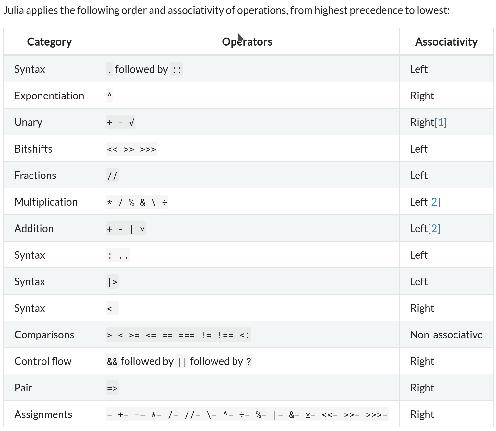

# Useful Functions

## Type System
```julia
typeof(1) # Int64
```

# Numberic System

## Type Bound
```julia
typemin(Int64) # -9223372036854775808
typemax(UInt128) # 0xffffffffffffffffffffffffffffffff
```

## bitstring
```julia
bitstring(0x14) # "00010100"
```

## Type Cast
```julia
Int32(20)
UInt8(20)
UInt16(0x14FFF) # ERROR: InexactError: trunc(UInt16, 86015)
```

## Symbol Cast
```julia
a = Int8(-20) # -20
a2 = unsigned(a1) # 0xec
a3 = signed(a2) # -20
```

## Boolean
```julia
Bool(1) # true
Bool(0) # false
Bool(20) # ERROR: InexactError: Bool(20)
```


## Floats
```julia
zero(1.0)
zero(Float32) # standard zero
one(32)
one(Float64) # standard one
eps(5.0) # epsilon at 5.0
eps(Float64) # epsilon at 1.0
prevfloat(x) == x - eps(x)
nextfloat(x) == x + eps(x) 
```

## Abnormal Values
```julia
Inf
-Inf
NaN
-NaN
1.2/0 # Inf
isfinite(Inf) # false
isinf(Inf) # true
isnan(10) # false
isnan(-NaN) # true
isnan(NaN15) # true
```

## Constants
```julia
Base.MathConstants.pi
Base.MathConstants.ℯ
Base.MathConstants.catalan 
Base.MathConstants.eulergamma 
Base.MathConstants.golden
```

## Rational
```julia
numerator(2//3) # 2
denominator(2//3) # 3
```
The type of denominator and numerator are integers but float and rational can be casted to each other.

## Complex
```julia
1 + 2im
complex(1, 2)
```
- real()
- imag()
- reim()
- conj()
- abs()
- abs2()
- angle()

## Random
- rand()
- randn() normal distribution
- randexp() exponential distribution

## Arbitary Number
- BigInt
- BigFloat
- big() promote normal numbers to big numbers

## seperator
```julia
10_000_000
0xdeaf_beef
0b1011_0010
```

## Promotion

Julia supports three forms of numerical conversion, which differ in their handling of inexact conversions.

- The notation `T(x)` or `convert(T,x)` converts `x` to a value of type `T`.
    - If `T` is a floating-point type, the result is the nearest representable value, which could be positive or negative infinity.
    - If `T` is an integer type, an InexactError is raised if `x` is not representable by `T`.

- `x % T` converts an integer `x` to a value of integer type `T` congruent to `x modulo 2^n`, where n is the number of bits in T. In other words, the binary representation is truncated to fit.

- The Rounding functions take a type `T` as an optional argument. For example, `round(Int,x)` is a shorthand for `Int(round(x))`.

The following examples show the different forms.


# Operator

## Special cases
- `x ÷ y` remainder
- `x\y == y/x`
- `√x == sqrt(x)` 
- `∛x == cbrt(x)`
- `x ⊻ y == xor(x, y)`
- `x>>y` care the symbol
- `x>>>y` ignore the symbol

## Precedence and Associativity



