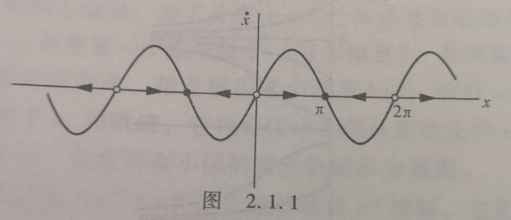

# 直线上的流

#### 一阶动力学系统：

$$
\dot{x} = f(x)
$$

注意非自治方程$\dot{x} = f(x, t)$应当视为二阶动力学系统.

上图代表的动力学系统为
$$
\dot x = sin x
$$

- 图示直线上的箭头表示向量场，决定了每个$x$处的速度向量$\dot x$
- $\dot x = 0$的地方称为不动点，周围向量指向的称为稳定的不动点，也叫吸引子、汇；周围向量远离的称为不稳定的不动点，也叫排斥子、源。

#### 探究稳定性的一般方法

同以前一样,我们设想流体沿着实轴以局部速度$f(x)$流动。这种虚拟流体称为相流,而实轴是相空间。流在$f(x)>0$处朝右流动, 在$f(x)<0$处朝左流动。

为了寻求$x=f(x)$从任意初始条件$x_0$出发的解,我们在$x_0$处放置一个虚拟粒子(称为相点),并观察它如何随流而运动。随着时间变化,相点根据某个函数$x(t)$沿着$x$轴运动。这个函数称为基于$x_0$的轨迹,它代表微分方程从初始条件$x_0$出发的解。

系统所有不同的定性轨迹称为相图。相图的出现由$f(x^*)=0$定义的不动点$x^*$控制,它们对应于流的停滞点。实心黑点是稳定不动点(局部的流指向它), 虚点为不稳定不动点(流始终远离它)。关于原来的微分方程,不动点表示平衡解(有时称为稳态解,或静止解。因为若初始条件为$x=x^*$,则在任意时间都有$x(t)=x^*$)。如果所有充分小的扰动都会随时间消失,那么平衡点被定义为稳定的。因此,稳定的平衡点在几何上可表示为稳定的不动点。相反地,在不稳定的平衡点处干扰随时间增大,代表不稳定的不动点。

#### 线性稳定性分析

通常的手法为在不动处进行线性化分析。
令$x^*$为一个不动点,$\eta(t)=x(t)-x^*$是偏离$x^*$的小扰动。为了观察小扰动是增加还是减小,我们导出一个关于$\eta$的微分方程。
$$
\dot\eta = \frac{\mathbb d}{\mathbb{dt}} (x - x^*) = \dot x = f(x) = f(x^* + \eta)
$$
对上式进行泰勒展开，得到
$$
f(x^* + \eta) = f(x^*) + \eta f'(x^*) + O(\eta^2)
$$
由于$x^*$代表不动点，$f(x^*) = 0$上式进而化为：
$$
f(x^* + \eta) = \eta f'(x^*) + O(\eta^2)
$$
如果$f'(x^*) \ne 0$, $O(\eta^2)$可以省略，上式近似化为：
$$
\dot \eta \approx \eta f'(x^*)
$$
当$f'(x) > 0$时,扰动以指数律增加；$f'(x) < 0$时，以指数律减少；$f'(x) = 0$时，$O(\eta^2)$项不应忽略，此时应当结合图像具体分析，且会出现半稳定等情况。

#### 存在性与唯一性

#### 振动的不可能性

#### 势

#### 计算机数值计算

（未完待续）